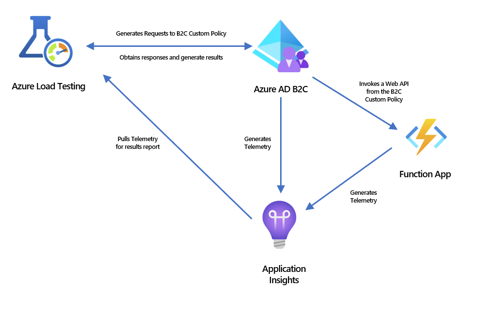

# Load Test Azure AD B2C Ciam Flows using Azure Load Testing Service 

This sample intends to show how to create and run a load test of Azure AD B2C user flows and custom policies (including dependencies), and evaluate the results using the Azure Load Testing Service. 

Use this sample to perform a load test and determine your web application and B2C flows behavior under anticipated peak load conditions, identify bottlenecks and determine which element is causing degradation.

This sample uses [Apache JMETER](https://jmeter.apache.org/?msclkid=ae56f532c42211ec9d6300549d60d495) and [Azure Load Testing Service](https://azure.microsoft.com/en-us/services/load-testing). 

The authorization flow used for testing is [OAuth 2.0 Authorization Code Flow](https://docs.microsoft.com/en-us/azure/active-directory-b2c/authorization-code-flow?msclkid=4d616c56c62911ec94ab250cff34630b) 

# Sample Test components
This sample test includes the following components:

1. [Custom policy](policies/readme.md) to implement the custom CIAM flow
1. [Web Api](web-api/readme.md) to be called from the custom CIAM flow
1. [Python script](python-script/readme.md) for user creation 
1. [JMETER script](jmeter-script/readme.md) for load testing

# Test Architecture
This sample test architecture involves the following components / services:

 1. Azure AD B2C Tenant
 1. Azure Function Web API
 1. Application Insights
 1. Azure Load Testing Service

 

# Run the Sample Test

Running the sample test will help to understand the effort required to perform a load test before creating a new one from scratch.

To run the sample test follow this steps:

1. Setup Test Environment
    1. Azure AD B2C Tenant
    1. Azure Function Web API
    1. Application Insights 
    1. Azure Load Testing 
1. Set up custom policies
1. Create / configure users for testing
1. Setup JMETER Test plan 
1. Execute the load test
1. Evaluate the results

Detailed steps on how to run this sample are documented [here](run-sample-test.md).

# Create a new Test 

This documentation helps to understand how to create a load test for a different set of user flows, custom policies and web applications. 

Use JMETER recording capabilities and the information provided here to speed up the creation of a new load test from scratch.

Detailed steps on how to create a new Load Test are documented [here](create-test-from-scratch.md).

    >[!NOTE]
    > This Sample Test does not include MFA / OTP scenarios as these involve automating the reception of the OTP from an external source (email, sms).

# Evaluate results

This documentation helps to understand what information can be obtained from the evaluation of the results, to: 

1. Observe the behavior of the entire solution on a certain production load.

1. Measure the performance of the CIAM flows and Web Application to verify improvements. 

Detailed steps on how to evaluate results can be found [here](evaluate-results.md).

