# How to create Load Test from scratch 

Create a Load Test from scratch to evaluate the behavior of a different set of user flows, custom policies and web application using the steps described below:

# Requirements

1. Apache JMeter Installed ([download link here](https://jmeter.apache.org/download_jmeter))
1. The URL for the custom policy deployed in Azure B2C that will be tested
1. At least one user with credentials to run the custom policy and record the steps in the test

# 1 - Create a Test Plan

Run JMETER from the jmeter.bat file that resides inside the "bin" folder. Once JMETER loads click on "File" > "Templates" and in the dialog presented, select "Recording with Think Time", then hit "Crete" button below.

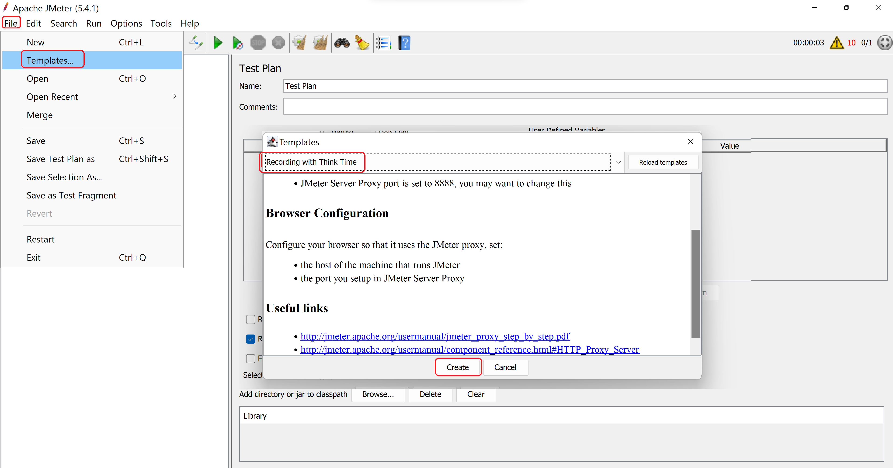

The test plan is created with the test elements needed for recording.

# 2 - Configure Include and Exclude URL patterns

It is very likely that requests from other apps will will be included in the recording by default. To control that, and only record the http requests related to the B2C custom policy, you can use the include and exclude URL in the Test Script Recorder element.

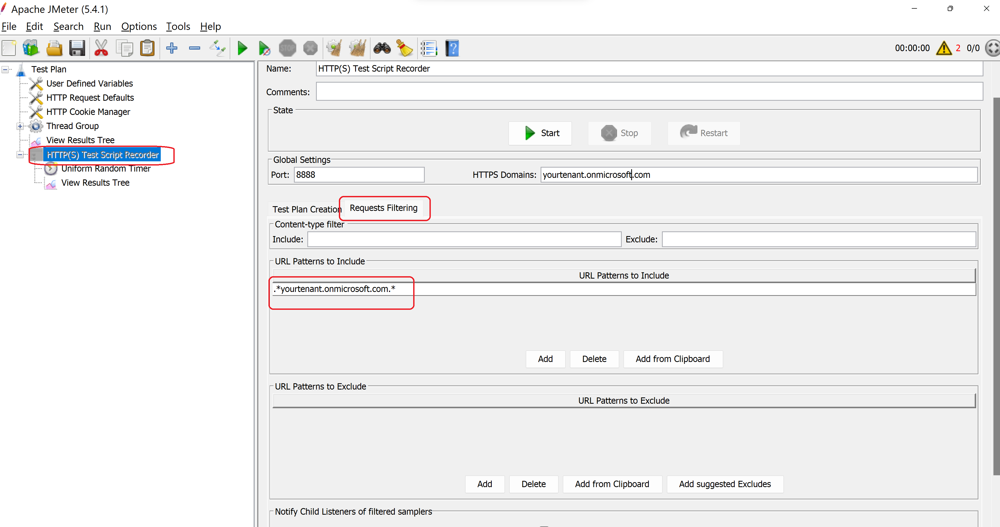

Be sure to include your domain by including an entry like this in "URL Patterns to Include":

.*yourtenant.onmicrosoft.com.*  (please note that the points "." before the stars "*" are required)

Remove all the elements in the exclude group.

If you are using custom content like HTML, CSS or JAVASCRIPT be sure to include the source of these elements in the include list. 

# 3 - Configure Proxy 

Configure the browser or system proxy to point to JMETER Proxy which by default will use:

Host: http://localhost
Port: 8888 (this port value can be changed in test recorder configuration)

# 4 - Run the test recorder

Go to the Test Script Recorder element and click on "Start" button. This action will start the JMETER proxy which will intercept the browser requests. 

Open a browser and start navigating the custom policy to test.

# 5 - Install the JMETER Root CA certificate 

The first time you run the test recorder, a file called ApacheJMeterTemporaryRootCA.crt will be generated in JMETER_HOME/bin folder. You need to install this certificate as a trusted root CA in your browser in order to record the https requests. 

To install this certificate in windows you can do the following:

1. Go to the file
1. Right click and select "Install Certificate"
1. In the pop up window select "Local Machine" and click "Next"
1. Select the option "Place all certificates in the following store"
1. Click "Browse"
1. Select "Trusted Root Certification Authorities" and click "OK"
1. Click "Next" and then click "Finish"
1. You should receive a message saying "The import was successful" and then click "OK"

For other operating systems you can follow JMETER documentation [here](https://jmeter.apache.org/usermanual/component_reference.html#HTTP%28S%29_Test_Script_Recorder). 

# 6 - Review requests saved

After recording the test you can review the http requests saved in the Thread Group. If you are using the policy in this sample it should look like this:

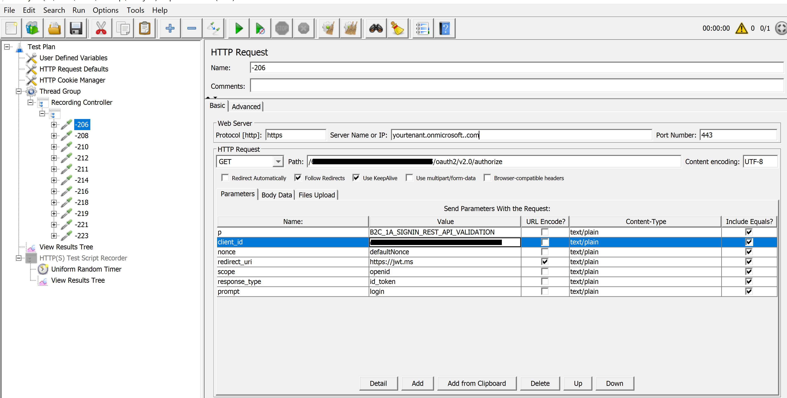

Remember to click "Save" button to save your script!

# 7 - Parametrize the Test Plan 

This portion of the documentation will be based on the HTTP requests generated by recording the  custom policy included in the sample. This will be different for other policies being tested but the process will be similar in most cases.

# 8 - Configure Uniform Random Timer 

JMETER uniform random timer is used to generate fixed+random amount of time delay between 2 requests in your test plan. This element has to configurations: 

1. Random Delay Maximum: allows you to define the max number of milliseconds to add between requests
1. Constant Delay Offset: allows to define a constant number of milliseconds to add between request

We recommend setting this settings to simulate a human behavior, for example:

1. Random: 500
1. Constant: 1000 

# 9 - Rename / Remove requests 

Go through each request recorded in the Thread Group and rename it to make it easier to recognize in the future. 

At this point you can also remove requests that are not relevant to the test like static resources (html, images, etc.) or tracing related requests.

In our example this could look like this:

# 10 - Extract the Variables from the Authorize endpoint response

Two values needs to be extracted from the Authorize endpoint response to be used in the following steps of the flow: StateProperties and Csrf_Token. 

To extract these values you need to do add a Regular Expression Extractor for each one:

1. Right click on the "Authorize" request (first one recorded in the sample)
1. Select "Add", "Post Processors" and "Regular Expression Extractor" from the menu
1. This will add an item in the HTTP request element
1. Configure the regular expression for StateProperties:
    * StateProperties: .*StateProperties\=([^\"]*)
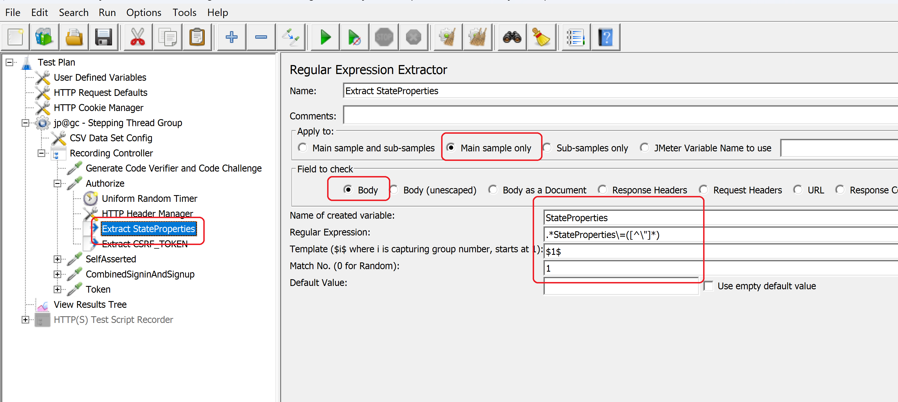
1. Configure the regular expression for Csrf_Token:
    * Csrf_Token: .*x-ms-cpim-csrf\=([^\;]*)
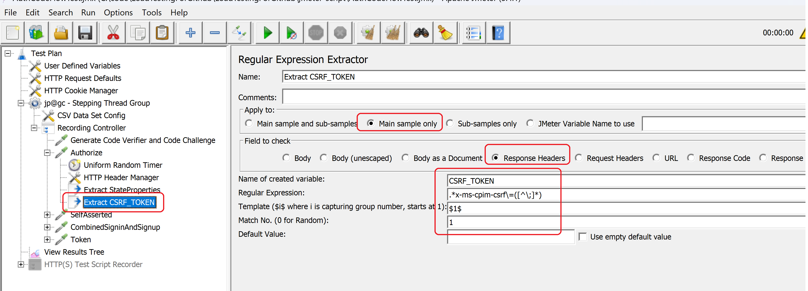

# 11 - Replace variables in subsequent requests.

Now that you obtained the StateProperties and Csrf_Token values in variables you must use them in the subsequent HTTP Requests. 

StateProperties is used mainly as query string parameters and Csrf_Token is mainly used as part of the HTTP Headers of the request.

You must look for this values in the requests and replace them with the variable using this syntax: ${VariableName}

For example:
SelfAsserted?tx=StateProperties=${StateProperties}&p=...

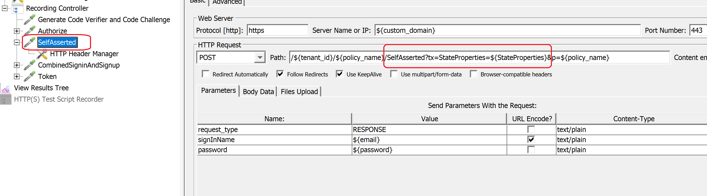

# 12 - Generate PKCE Code Verifier and Code Challenge

In order to test the Auth Code + PKCE flow with the policy you will need to generate both values and store them as variables.

In the sample JMETER script you can find a step that does that using a Groovy script:

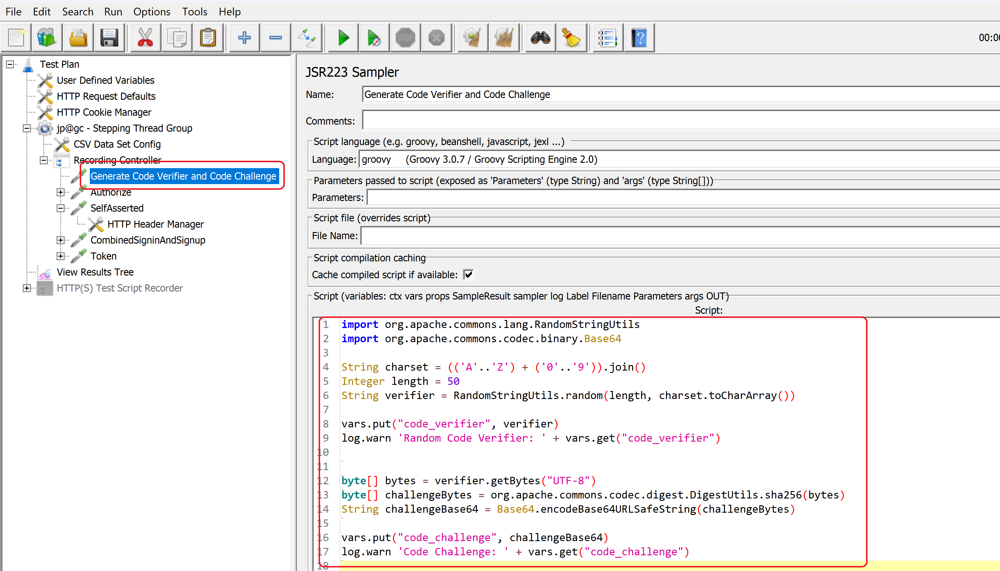

# 13 - Parametrization of other values (optional)

It is useful to parametrize other values recorded in the requests to easily execute the test in other environments.

For example:
1. Client_Id 
1. policy_name
1. redirect_uri
1. scope
1. tenant_id
1. custom domain

In the sample JMETER script those values are parametrized as an User Defined Variable as shown below:

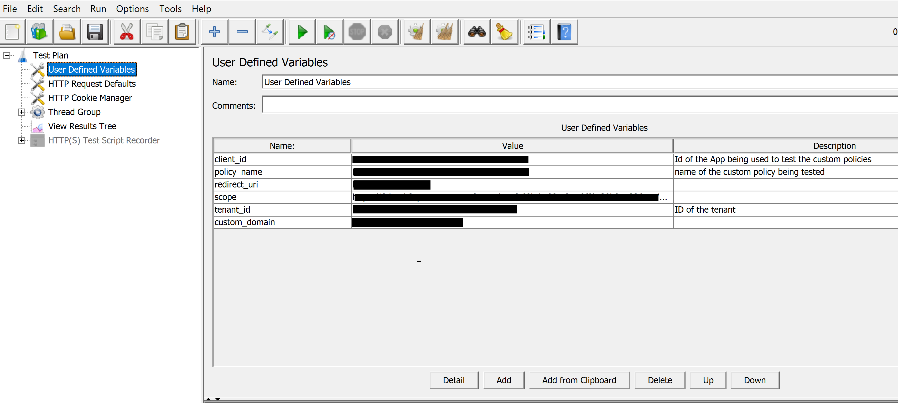

These variables can be used in requests so any change in the environment can be done just replacing the value of the variable.

# 14 - Validate parametrization by executing a smoke run 

Once the parametrization and value replacement is done you are good to do a smoke run with 1 user just to validate that the recording and parametrization is working

To do this go to  the "Thread Group" element, configure "Number of Threads" to 1, "Ramp-up" to 1 second and "Loop Count" to 1, and click on the "Play" button to run the test.

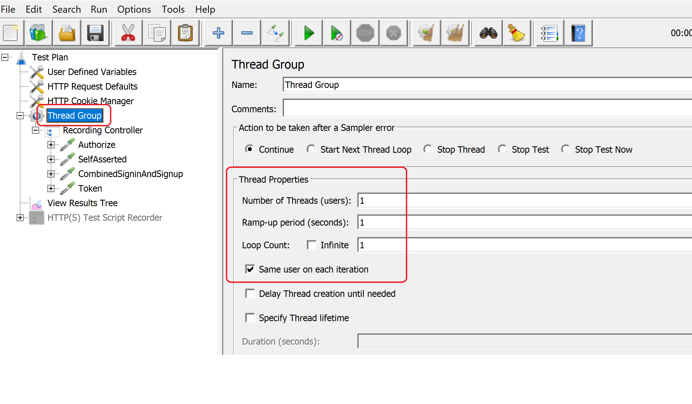

This can take a few seconds depending on "Uniform Random Timer" setting configured. 

After the test is run you can validate if the run was successful by looking at the "Results Tree" element as shown below.

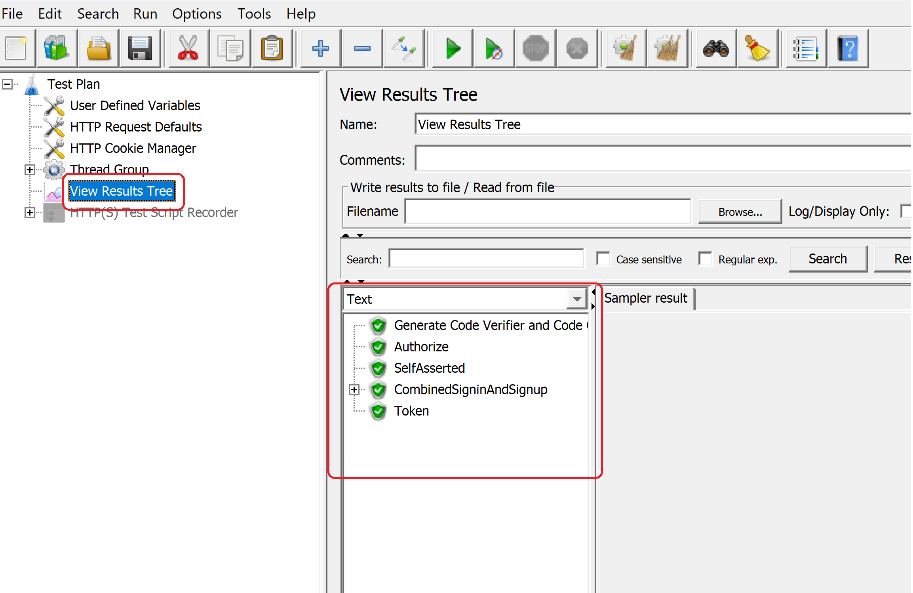

If all the items are Green then the run was successful.

If an item is red you should review the "response" data to troubleshoot the error.

# 15 - Parametrize Users 

After the initial validation is done you need to parametrize the users to run the load test. For this we need to configure a CSV Config Element in the test and use the same CSV that was used to create accounts in B2C.

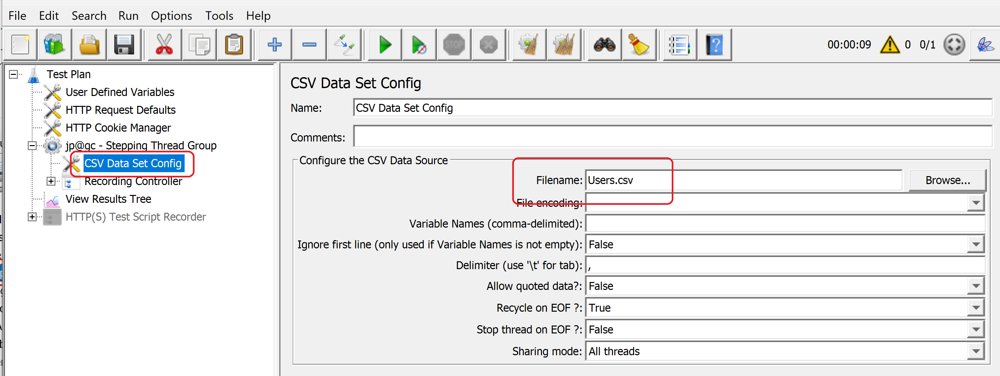

This will allow the test to execute using different identities.

It is important that the number of users created in B2C and configured in the CSV is large enough to run the test - using a small set of users to simulate a large number of authentications can generate test errors.

Depending on the custom policy configuration one or more requests in the recorded script should be parametrized with information included in the CSV.

In the current sample only UserName and Password is being read from the CSV file but more columns can be added to the CSV and used in different requests as parametrization.

# 16 -Run a light test to verify user parametrization

At this point is convenient to configure a light test using a small set of users in order to validate that the CSV configuration / parametrization is working as expected.

In the sample JMETER script some results are written in test logs that allows the verification of the process. 

Click on the yellow icon on the top right of JMETER script editor to open log window and search for the token log entry as shown below:

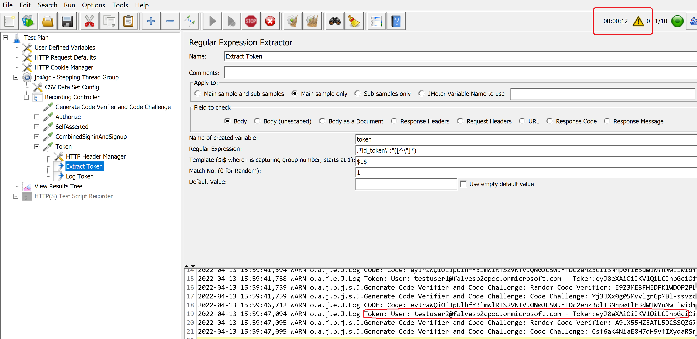

# 17 - Configure Azure Load Testing Service to run the test

Once you have tested the JMETER script locally you can create and run the load test using Azure Load Testing Service.

Please refer to Azure Load Testing [documentation](https://docs.microsoft.com/en-us/azure/load-testing/quickstart-create-and-run-load-test). for details on how to upload and run the tests.

# Note on Token extraction script

There is a relation between the type of token requested in the token endpoint request and the script to extract the token from the response.

If the request is used with the "openid" scope, an "id_token" will be returned so the extraction script will need to use this regular expression: .*id_token\=([^\"]*)

If a different scope is used, an "access_token" will be returned so the extraction script should look for the value with this regular expression: .*access_token\=([^\"]*)

