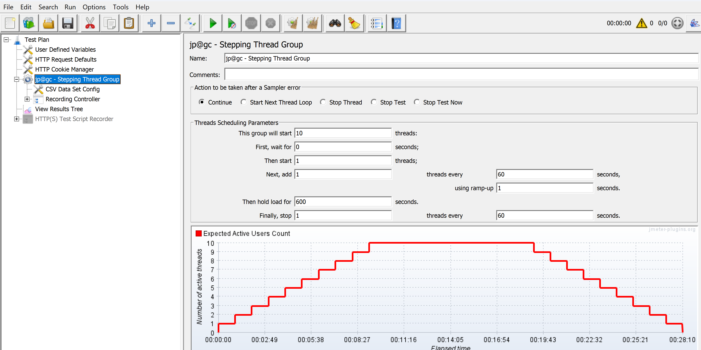
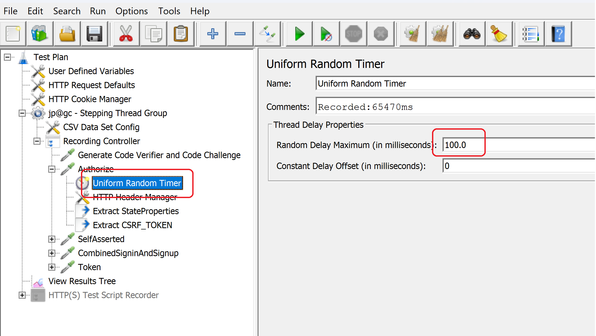
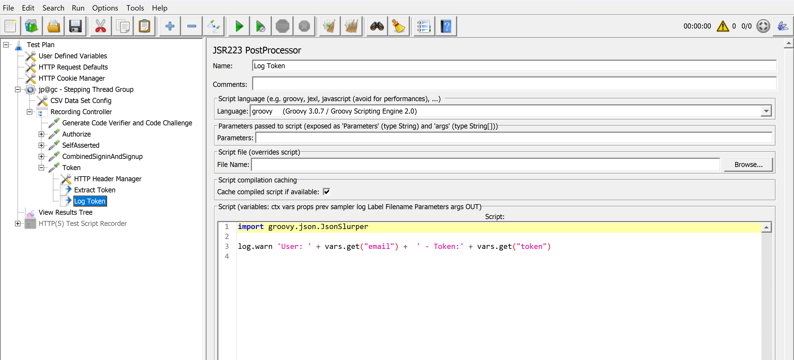
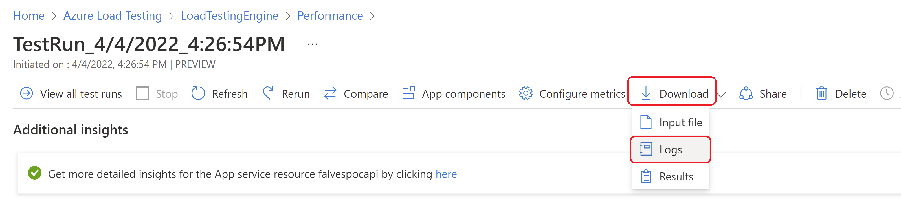
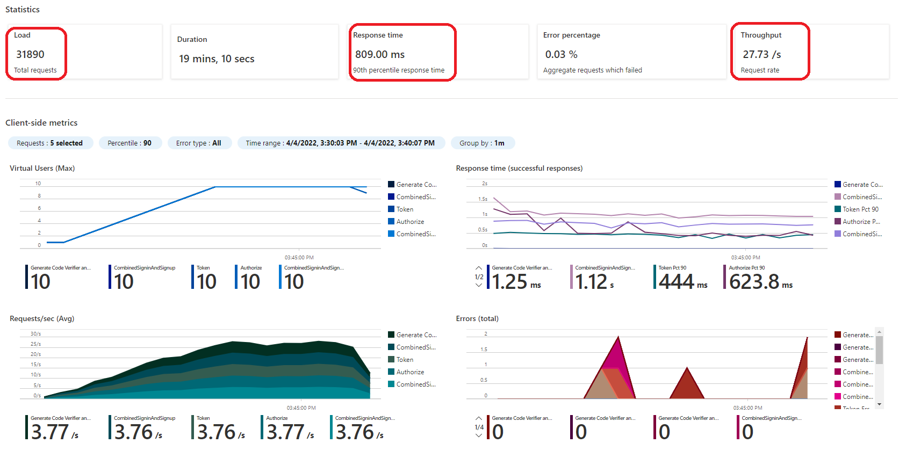
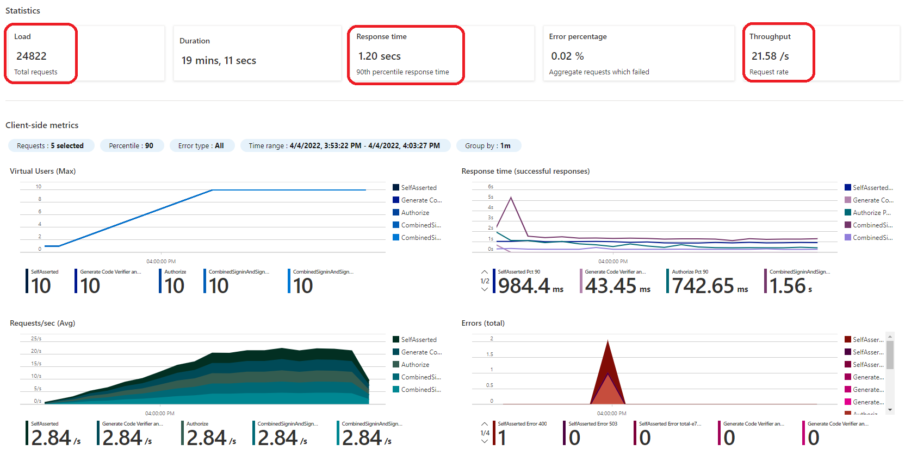
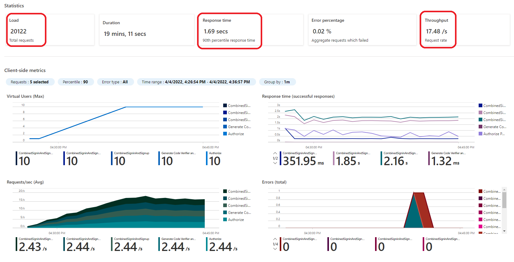
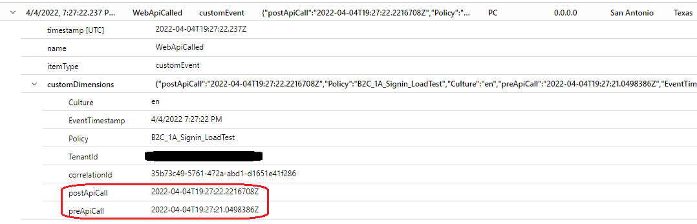
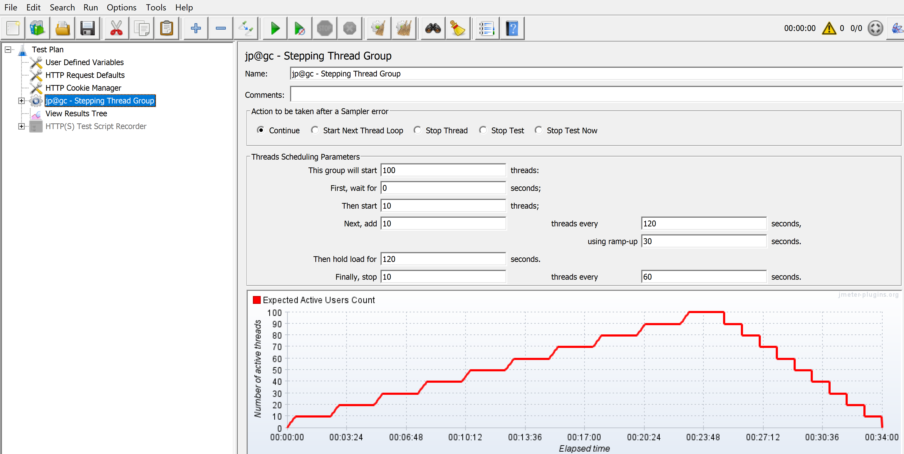
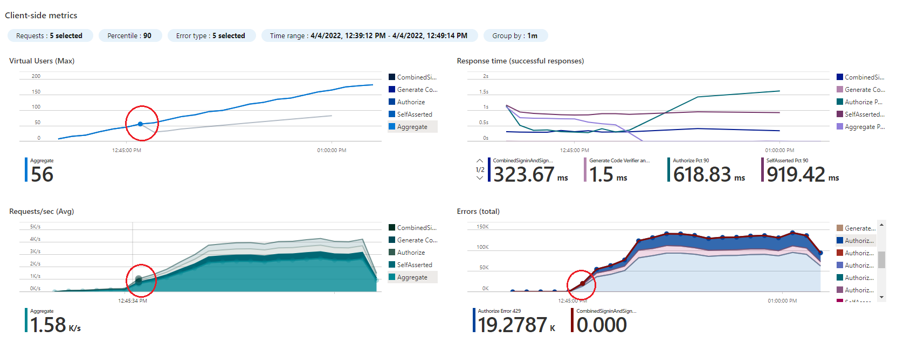

# How to evaluate Load Test results 

Load tests can be used to answer different questions about the solution (Web Application / B2C custom policies) performance, capacity, etc. 

This sample is focussed on three:

1. ¿Will the solution performance be acceptable during peak production load?
1. ¿What is the performance of the end-to-end flow? / ¿Did the performance improved after a change was made? 
1. ¿What is the maximum capacity that the end-to-end flow can support?


For each question a different parametrization and result evaluation should be considered, as described below:


# 1 - Test to determine if performance on peak load is acceptable (Load Test)

In order to determine if an expected load will perform for a given user flow the following parameters of the test must be defined:

1. Maximum number of end-to-end user flows expected to run in a specific period of time: 
    1. this information should be carefully estimated 
    1. needs to be focused on number of end-to-end flows (from calling authorize endpoint until token is obtained) and not in requests per second
    1. for example: "Need to support 1,500 authentication flows per hour"
1. Maximum response time allowed (requests)
1. Maximum percentage of errors (requests)

## How to configure test parameters

There are many ways to configure the Thread Groups (virtual users) to generate the expected load. It is important to consider a ramp-up, steady-load, and cool-down settings as shown below:



It is also important to configure a random wait time to simulate organic user behavior in requests. This can be done using the "Uniform Random Timer" element in each request as shown below:




## Determine the number of end-to-end flows executed by reading the logs

In the sample JMETER script there is a "post processor" action after the Token endpoint call that generates a log. Each entry in the log with this information is an execution of the last step in the flow and can be used to count the number of executions.



The log file can be downloaded after test execution using the "download" menu as shown below:



## Determine time taken by test execution, response time and error percentage

This information can be obtained from the test results dashboard as shown below:


## How to evaluate results

If the number of end-to-end flows executed (# of tokens obtained) in the execution time is equal or greater than the expected, the response time and error rate are below the threshold then the test should be considered successful.

# 2 - Test to determine performance and measure improvement of changes

In order to determine improvement an iteration of the test must be performed after each change in the code base (usually the Web APIs called) and compare the results with previous results. 

In this specific example a load pattern with a ramp-up period is defined (not steps) to run for a specific time - stabilizing the load. 

## How to configure test parameters

Also it is important to distribute the load correctly and use a ramp-up, steady-load, and cool-down settings as shown below:


## How to evaluate results

Evaluation must include these results:

1. Number of Requests
1. Response Time
1. Throughput

Please take into consideration that no significant errors should be present in the results in order to be comparable. 

For example, the results here were produced by increasing a fictitious delay in the Web API Called by the custom policy changing the following lines of code.

```javascript
    //this lines simulate a delay in execution of the api 
    // const stop = new Date().getTime() + 1000;
    // while(new Date().getTime() < stop);  
```

See Web API code documentation [here](web-api/readme.md)

### First run with no delay in Web API

Notice the following results:

1. Total number of requests: 31,890
1. Response time: 809 ms
1. Throughput: 27.73 request / sec



### Second run with 500 ms delay in Web API

Notice the following results:

1. Total number of requests: 24,822
1. Response time: 1.2 secs
1. Throughput: 21.58 request / sec



### Third run with 1 second delay in Web API

Notice the following results:

1. Total number of requests: 20,122
1. Response time: 1.69 secs
1. Throughput: 17.48 request / sec



### Result comparison

When performance of the Web API decreases:

1. Total number of requests decreases 
1. Response times increases
1. Throughput decreases


### Web API telemetry using App Insights

In the sample custom policy App Insights telemetry is configured to record a "custom event" with the API performance information.

See the custom policy [readme](policies/readme.md)

This custom event records the time before and after executing the Web API from Azure AD B2C point of view, as shown below:



This information is useful to understand the Api performance received in B2C.


## Include Load Testing in CI/CD pipelines to detect performance regressions

It is possible to automate the execution of load tests to detect performance regressions.

Azure Load Testing Service can be integrated with:

* Github Actions as described [here](https://docs.microsoft.com/en-us/azure/load-testing/tutorial-cicd-github-actions?wt.mc_id=loadtesting_acomresources_webpage_cnl)
* Azure Pipelines as described [here](https://docs.microsoft.com/en-us/azure/load-testing/tutorial-cicd-azure-pipelines?wt.mc_id=loadtesting_acomresources_webpage_cnl)


# 3 - Load Test to determine maximum capacity (Stress Test)

The idea behind this test is to increase the load in "Steps" until a limit is reached. 

Usually these limits are:

1. Maximum response time 
1. Maximum amount of errors 

In this specific case of this sample, 3% as the maximum error is allowed and 1.5 seconds as the maximum time taken to complete a sign-in is considered.

When a limit is reached the number of requests per second received represents the capacity of the system being tested.

## How to configure test parameters

For this kind of tests a "Stepping Thread Group" is recommended, for example the one described [here](https://jmeter-plugins.org/wiki/SteppingThreadGroup/)

The idea is to increase the load in steps with a proper ramp up and 




Consider also incrementing the number of "nodes" used by the Azure Load Testing Service if the limits are not reached with the initial configuration. Each "node" will execute the same pattern with the same load at the same time, so be careful on setting up too many nodes at once.

## How to evaluate results

Results evaluation must include this:

1. Response Time
1. Errors

For example in the following results of Azure Load Testing Service you can see that with approximately 60 virtual users, 1.58 K/s requests are generated producing errors with status code 429, thus indicating that the throttling limit has been reached.

Consider that a virtual user in this context does not represent one user executing the flow. It can be described as a thread that runs the custom policy time after time during the test duration.  In the result below, with 56 virtual users running in parallel 1,580 requests per second were generated.   




# Azure AD B2C Throttling and HTTP Status Code 429 error code.

Azure AD B2C throttling aims to prevent or limit the amount of resources a single tenant can have on the overall service, so that other tenant’s services and experiences will not be negatively impacted. There is no hard limit around throttling, as the service is dynamic and different circumstances may affect the overall performance of the service. If you reach the throttling Azure AD B2C returns HTTP Status Code 429 error code.

To understand Azure AD B2C limits, see this [document](https://docs.microsoft.com/en-us/azure/active-directory-b2c/service-limits?pivots=b2c-custom-policy)

 

