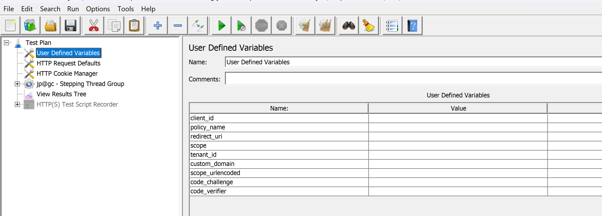
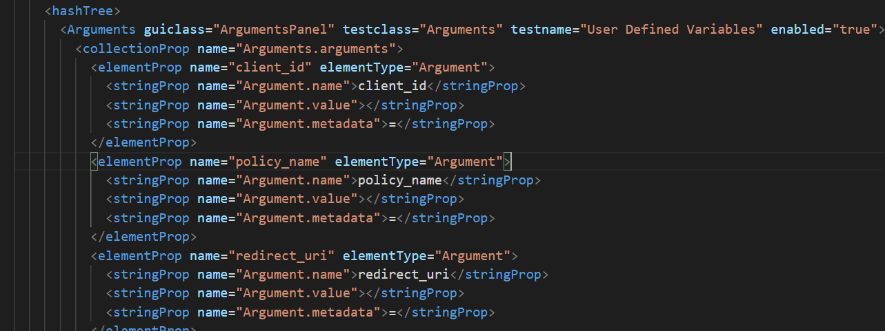

# How to run Sample Test

Run the sample load test to gain understanding on the components of the test and how they interact using the steps described here.

# Requirements

1. An Azure AD B2C Tenant instance.
    1.User with the following permissions: [SEE PERMISSIONS NEEDED]
1. An Azure Function app instance.
    1. The [sample Web API](web-api/readme.md) deployed. 
1. An Applications Insights instance.
    1. An instrumentation key value.
1. An Azure Load Testing instance.

# 1 - Setup custom policies  

To understand how set up the tenant to run custom policies, and how to obtain the values needed for this step please refer to the documentation [here](https://docs.microsoft.com/en-us/azure/active-directory-b2c/custom-policy-overview#prepare-your-environment).

Open the custom policy files provided [here](policies/) 

Replace "yourtenant" with the tenant name in all policy files.

Replace "ProxyIdentityExperienceFrameworkAppId" and "IdentityExperienceFrameworkAppId" with the corresponding values for your tenant.

Replace the string "[Replace with App Insights Instrumentation Key]" with the corresponding key. 

Replace the string "[Replace with Web API URL]" with the url of the Azure Function.

Upload the custom policies to the tenant in this order (assuming that Base, Localization and Extension files are already present) in this order:

1. TrustFrameworkExtensions_LoadTest.xml
1. Signin_LoadTest.xml

Validate that no errors are shown after upload to continue.

# 2 - Setup users in B2C Tenant

It is important that the set of users created / configured in the tenant are the same used in JMETER CSV configuration item.

A sample python script that creates users from a CSV is provided [here](python-script/readme.md)

An alternative sample using C# can be found [here](https://github.com/azure-ad-b2c/user-migration/tree/master/seamless-account-migration)

# 3 - Setup JEMETER Test plan 

The following User Defined Variables need to be configured with the proper values in the JMETER USer Defined Variables:

1. client_id: the id of the app registration, for example: d20df654-c14d-4a72-8679-b68c94a44132
1. policy_name: the name of the policy for example: B2C_1A_SIGNIN_LOADTEST
1. redirect_uri: the redirection uri of the app registration, for example:  https://jwt.ms
1. scope: the scope that will be used for the policy, for example: openid
1. tenant_id: the id of the Azure B2C Tenant, for example: 432ce9fc-6b3d-4f59-93d7-8e1112dfed13
1. custom_domain: the domain name of the Azure AD B2C instance. If not using custom domains, for example: yourtenant.onmicrosoft.com

If JMETER is installed on the system open the JMETER test plan and replace these User Defined Variables

If JMETER is not installed open the test plan xml file and replace the values of the User Defined Variables directly, in the "Arguments" nodes as shown below:

# 4 - Setup Azure Load Testing Service and Run the test

Please refer to Azure Load Testing documentation for details.

1. [Create and Run Load Tests](https://docs.microsoft.com/en-us/azure/load-testing/quickstart-create-and-run-load-test). 

1. [Add CSV file to test](https://docs.microsoft.com/en-us/azure/load-testing/how-to-read-csv-data)

